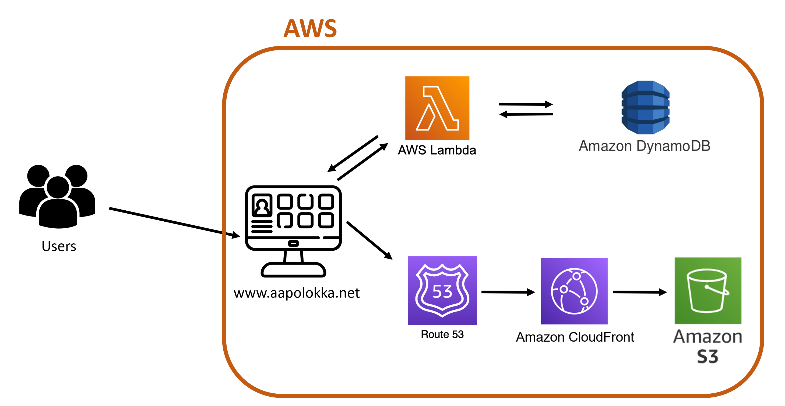

# My Personal Web Portfolio

## Introduction

Welcome to my personal web portfolio project, crafted by partly following the AWS Cloud Resume Challenge. This project also served as a hands-on learning experience in AWS, HTML, and CSS. I'm thrilled to share the outcome of this project and hope you find my portfolio both informative and visually appealing.

**[My Web Portfolio](https://www.aapolokka.net/)**

## Architecture

The architecture of this project integrates various AWS services to ensure a robust and scalable web presence. Here's a breakdown of the key components: 

### 1. Website Hosting
The HTML/CSS website is securely stored in an AWS S3 bucket, leveraging the flexibility and durability of Amazon S3. To optimize content delivery, AWS CloudFront is employed as a content delivery network (CDN).

### 2. Domain Management
The domain is managed through AWS Route 53, providing a seamless and reliable method for domain registration and DNS management.

### 3. View Counter
A dynamic element is added to the website in the form of a view counter, powered by AWS Lambda and DynamoDB. The Lambda function acts as an API, reading and updating the view count stored in DynamoDB.

### 4. Automated Deployment
GitHub Actions are employed to streamline the deployment process. This allows for automated workflows, ensuring that updates and changes to the repository are seamlessly reflected in the live portfolio.

### Architecture Diagram

### Services Used
- **S3:** Object storage for hosting the website.
- **AWS CloudFront:** Content delivery network for optimized global access.
- **Certificate Manager:** Secures the communication with SSL/TLS certificates.
- **AWS Lambda:** Serverless compute service for implementing the view counter.
- **DynamoDB:** NoSQL database for storing and retrieving view count data.
- **GitHub Actions:** Automated workflows for continuous deployment.
